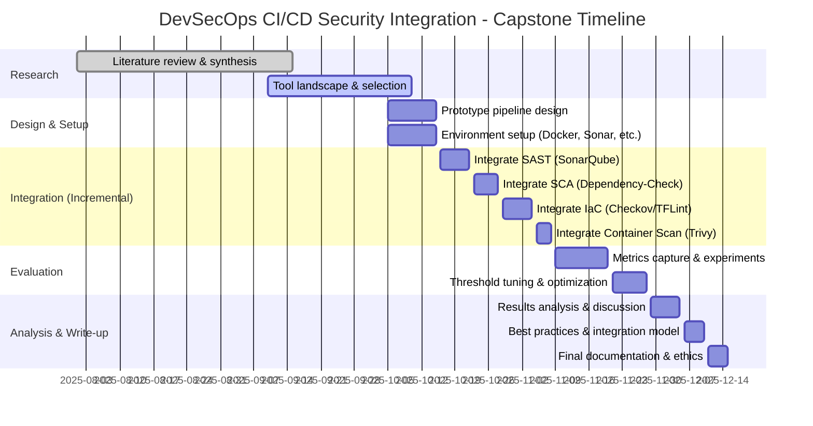

# Project Gantt (Mermaid)

```mermaid
gantt
    dateFormat  YYYY-MM-DD
    title DevSecOps CI/CD Security Integration - Capstone Timeline

    section Research
    Literature review & synthesis           :done,    task1, 2025-08-01, 2025-09-15
    Tool landscape & selection              :active,  task2, 2025-09-10, 2025-10-10

    section Design & Setup
    Prototype pipeline design               :         task3, 2025-10-05, 2025-10-15
    Environment setup (Docker, Sonar, etc.) :         task4, 2025-10-05, 2025-10-15

    section Integration (Incremental)
    Integrate SAST (SonarQube)              :         task5, 2025-10-16, 2025-10-22
    Integrate SCA (Dependency-Check)        :         task6, 2025-10-23, 2025-10-28
    Integrate IaC (Checkov/TFLint)          :         task7, 2025-10-29, 2025-11-04
    Integrate Container Scan (Trivy)        :         task8, 2025-11-05, 2025-11-08

    section Evaluation
    Metrics capture & experiments           :         task9, 2025-11-09, 2025-11-20
    Threshold tuning & optimization         :         task10, 2025-11-21, 2025-11-28

    section Analysis & Write-up
    Results analysis & discussion           :         task11, 2025-11-29, 2025-12-05
    Best practices & integration model      :         task12, 2025-12-06, 2025-12-10
    Final documentation & ethics            :         task13, 2025-12-11, 2025-12-15
```
